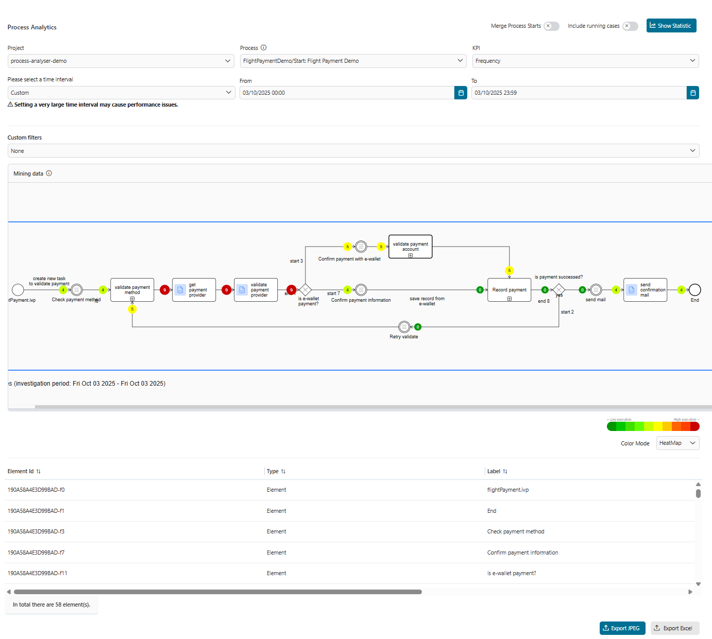
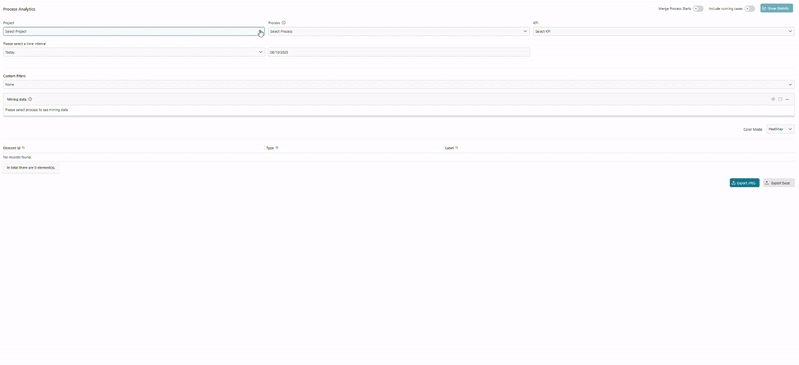
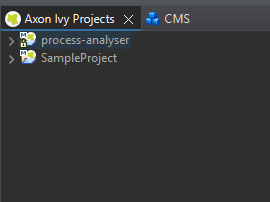

# Process Analyser

Axon Ivy’s Process Analyser Tool enables comprehensive insights into your workflow processes.

Key features:

- **Visualize Process Diagrams**  
  A clear and intuitive representation of your processes is provided through dynamic diagrams, which you are already familiar with from Axon Ivy.

- **Statistics at a Glance**  
  Visualize workflow usage and duration directly on the diagram.

- **Time-Based Analysis**  
  Filter and analyze data for specific time intervals.

- **Custom Attribute Filtering**  
  Utilize process-specific attributes (custom-field from task/case) to filter and refine your analysis for deeper insights.

- **Flexible Process Selection**  
  Well integrated with any processes from the same security context to leverage the tool's robust features.

- **Export Capabilities**  
  Export diagram and detailed Excel reports with frequency/duration statistics.



## Demo

In the first step, to enable the Process Analyzer to collect data, you need to run and complete at least one of the demo processes.


### Show Statistic

To view the result, start the Process Analyzer and select the PMV that matches the desired process and KPI type, then click the **"Show Statistic"** button. This will display a raw data visualized process diagram alongside an analyzed statistics table.



### Filter and configuration options

- **Filter:** To provide more comprehensive insights, the following additional filter criteria have been introduced:

  1. **Include running cases** By default, only closed cases are evaluated. Use this button to also include running cases in the evaluation.
  2. **Time interval filter:** This filter includes all cases whose start timestamps fall within the specified time range.
  3. **Custom filter:** This option allows users to filter cases based on custom field values (from the case or task) that match the specified conditions.


- **Mining Viewer Configuration Options:** The mining viewer offers the following configuration options:

  1. **Configure Viewer:** Select a focus element to automatically center it within the viewing area.
  2. **Zoom Level:** You can specify a zoom value to adjust the diagram to fit your screen, as an alternative to using Ctrl + mouse scroll.
  3. **Expand Viewer Panel:** Increase the viewing area by hovering over the bottom corner of the viewer and dragging it downward.
  4. **Open in New Tab:** For full control and an expanded view, you can open the mining viewer in a new browser tab.


- **Reporting Options:** Users can export data for reporting purposes using the two buttons located at the bottom-right corner of the user interface:

  1. **Export Excel:** Download all analyzed data in Excel format for further reporting or analysis.
  2. **Capture entire process:** Export the complete process diagram at the top (first) BPMN level in Full HD resolution, including all KPI values.
  3. **Capture current view:** Export only the currently visible mining diagram as it appears on the screen.


- **Custom color bar:** Customize the color of each KPI value using a gradient from light to dark, representing the progression from lower to higher values.


## Setup

To collect data and analyze your processes, please follow these steps:

1. Prepare your own project and processes.
2. Modify your processes for accurate data analysis

- For any process alternative with multiple outgoing flows, ensure that each flow contains at least one task element along its path.


3. Install Process Analyzer from Marketplace.

- After install Process Analyzer, the project structure should look like this



- For engine deployment, ensure that both process models are deployed within the same security context


4. Run your desired process to collect data.
5. Launch the Process Analyzer and follow the Demo tab to view the results.


6. (Optional) Update the process display name to avoid the process start technical name (e.g. FlightPlanningDemo/recommendDestination.ivp) being shown in the selection options. Multilanguage support for process names is also available.


```
@variables.yaml@
```

**Notice**

- **For complex process flows** _- such as those involving numerous alternatives, sub-elements, or rework loops,_ we are actively working on enhancing the accuracy of the data.
