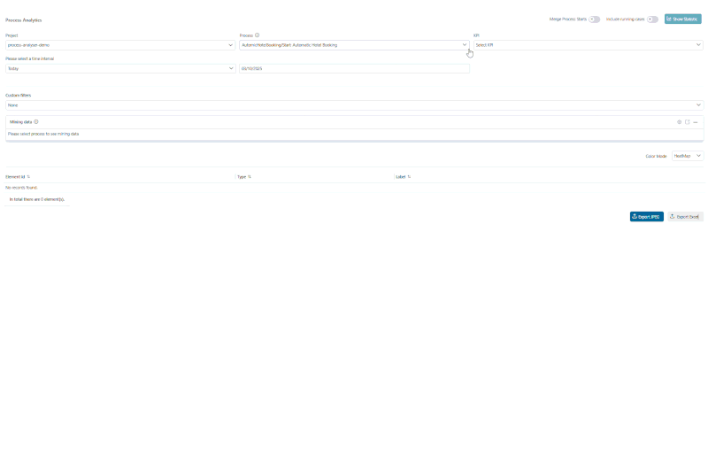

# Process Analyser

Axon Ivy’s Process Analyser Tool enables comprehensive insights into your workflow processes.

Key features:

- **Visualize Process Diagrams**  
  A clear and intuitive representation of your processes is provided through dynamic diagrams, which you are already familiar with from Axon Ivy.

- **Statistics at a Glance**  
  Visualize workflow usage and duration directly on the diagram.

- **Time-Based Analysis**  
  Filter and analyze data for specific time intervals.

- **Custom Attribute Filtering**  
  Utilize process-specific attributes (custom-field from task/case) to filter and refine your analysis for deeper insights.

- **Flexible Process Selection**  
  Well integrated with any processes from the same security context to leverage the tool's robust features.

- **Export Capabilities**  
  Export diagram and detailed Excel reports with frequency/duration statistics.


## Demo

### Show Statistic

To view the result, start the Process Analyzer and select the PMV that matches the desired process and KPI type. By default, analyses are separated by process starts (automatic vs. manual). Use the Merge Process Starts toggle to view a full analysis of each process. Then a raw data visualized process diagram alongside an analyzed statistics table will be displayed.


### Filter and configuration options

- **Filter:** To provide more comprehensive insights, the following additional filter criteria have been introduced:

  1. **Include running cases:** By default, only closed cases are evaluated. Use this button to also include running cases in the evaluation.
  2. **Time interval filter:** This filter includes all cases that start within the specified time range.
  3. **Custom filter:** This option allows users to filter cases based on custom field values (from the case or task) that match the specified conditions.


- **Mining Viewer Configuration Options:** The mining viewer offers the following configuration options.

  1. **Configure Viewer:** Select a focus element to automatically center it within the viewing area.
  2. **Zoom Level:** Set a zoom value to fit the diagram to your screen, or use **Ctrl + mouse scroll**.
  3. **Open in New Tab:** Open the mining viewer in a new browser tab for a larger, fully controllable view.
  4. **Expand Viewer Panel:** Hover over the bottom corner of the viewer and drag downward to increase the viewing area.


- **Reporting Options:** Use the buttons in the bottom-right corner to export data for reporting.

  1. **Export Excel:** Download all analyzed data in Excel format for further reporting or analysis.
  2. **Capture entire process:** Export the complete process diagram at the top (first) BPMN level in Full HD resolution, including all KPI values.
  3. **Capture current view:** Export only the currently visible mining diagram as it appears on the screen.


- **Color Bar Selection:** illustrates the progression from lower to higher KPI values.
  1. **Custom Color:** Customize the color of each KPI value using a gradient from light to dark.
  2. **Heatmap:** Automatically applies a color scale transitioning from green to red.



### Portal Custom Widget Integration

We support integrating the Process Analyzer into Axon Ivy Portal as a custom dashboard widget from version 12.0.10 onwards. This integration allows users to embed process analytics directly within their Portal dashboards, providing quick access to key performance indicators and process insights without leaving the Portal dashboard.


## Setup

To collect data and analyze your processes, please follow these steps:

1. Prepare your own project and processes.
2. Modify your processes for accurate data analysis

- For any process alternative with multiple outgoing flows, ensure that each flow contains at least one task element along its path.


3. Install Process Analyzer from Marketplace.

- After install Process Analyzer, the project structure should look like this


- For engine deployment, ensure that both process models are deployed within the same security context


5. Launch the Process Analyzer and follow the Demo tab to view the results.


6. (Optional) Update the process display name to avoid the process start technical name (e.g. FlightPlanningDemo/recommendDestination.ivp) being shown in the selection options. Multilanguage support for process names is also available.


```
@variables.yaml@
```
### Portal Custom Widget Integration

The Process Analyzer can be seamlessly integrated into Axon Ivy Portal as a custom dashboard widget, providing embedded analytics capabilities within your Portal Dashboard.

#### Prerequisites
- Axon Ivy Portal environment with dashboard configuration access
- Process Analyzer installed and properly configured in the same security context

#### Configuration Steps

1. **Access Widget Configuration**
   - Navigate to **Portal Dashboard Configuration** → **Widgets** section
   - Ensure you have administrative privileges to modify dashboard layouts

   

2. **Add Process Analyzer Widget**
   - Click **"Add Widget"** from the dashboard configuration toolbar
   - Select **"Process Analyzer"** from the **"Custom Widgets"** category

   

3. **Widget Configuration**
   - Provide a descriptive **widget name** for easy identification
   - Click **"Save"** to add the widget to your dashboard
   - Return to the main dashboard to begin initial configuration

4. **Widget Features & Limitations**
   - **Available Features:** Process selection, KPI type configuration, time interval filtering, color mapping
   - **Streamlined Interface:** Essential analytics features optimized for dashboard viewing
   - **Persistent Configuration:** All widget settings are automatically saved and restored through browser refreshes and user re-authentication

   

> **Note:** The widget mode provides a focused subset of the full Process Analyzer functionality, optimized for dashboard integration and quick insights.