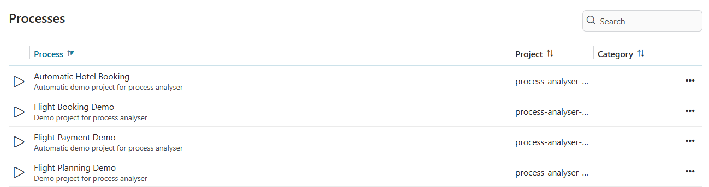
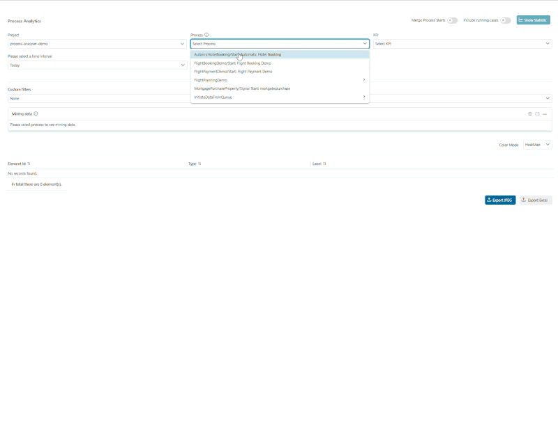

# Process Analyser
Axon Ivy’s Process Analyser Tool enables comprehensive insights into your workflow processes. 

Key features:
- **Visualize Process Diagrams**
: A clear and intuitive representation of your processes is provided through dynamic diagrams, which you are already familiar with from Axon Ivy.
- **Statistics at a Glance**
: Visualize workflow usage and duration directly on the diagram.
- **Time-Based Analysis**
: Filter and analyze data for specific time intervalls.
- **Custom Attribute Filtering**
: Utilize process-specific attributes (custom-field from task/case) to filter and refine your analysis for deeper insights.
- **Flexible Process Selection**
: Well integrated with any process from the same security context to leverage the tool's robust features.
- **Export Capabilities**
: Export diagram and detailed Excel reports with frequency/duration statistics.

## Demo

- In the first step, to enable the Process Analyzer to collect data, you need to run and complete at least one of the demo processes.

- To view the result, start the Process Analyzer and select the PMV that matches the desired process and KPI type, then click the **"Show Statistic"** button. This will display a raw data visualized process diagram alongside an analyzed statistics table. *(In this version, the data is limited to **"DONE"** cases with fewer than **TWO** alternative elements in their process.)*


- To gain deeper insights, additional filter criteria have been included: 
  1) **Time interval filter:** By default, this filter includes all **"DONE"** cases with a start timestamp that falls within the specified time range.
  2) **Custom filter:** This option allows users to filter cases based on custom field values (from the case or task) that match the specified conditions.



- For reporting purposes, users can export an Excel file containing analyzed data or a FullHD diagram with KPI values directly via the two buttons located at the bottom-right corner of the UI.


## Setup
To collect data and analyze your processes, please follow these steps:
1. Prepare your own project and processes.
2. Modify your processes for accurate data analysis 
- For any process alternative with multiple outgoing flows, ensure that each flow contains at least one task element along its path. *(It's still acceptable if there is only 1 out going path is mising task elements in its flow, as illustrated in the example process provided in the images.)*


3. Install Process Analyzer from Marketplace.
- After install Process Analyzer, the project structure should look like this


- For engine deployment, ensure that both process models are deployed within the same security context


4. Run your desired process to collect data.
5. Launch the Process Analyzer and follow the Demo tab to view the results.


```
@variables.yaml@
```

**Notice**
- **For complex process flows** *- such as those involving numerous alternatives, sub-elements, or rework loops,* we are actively working on enhancing the accuracy of the data.
