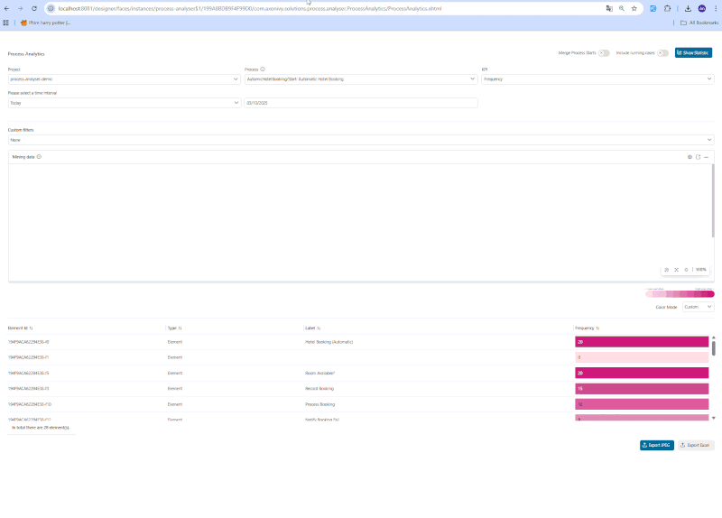

# Prozessanalysator

Das Process Analyser Tool von Axon Ivy ermöglicht umfassende Einblicke in Ihre
Arbeitsabläufe.

Wichtigste Funktionen:

- **Prozessdiagramme visualisieren**Eine klare und intuitive Darstellung Ihrer
  Prozesse wird durch dynamische Diagramme ermöglicht, die Sie bereits aus Axon
  Ivy kennen.

- **Statistiken auf einen Blick**Visualisieren Sie die Nutzung und Dauer von
  Workflows direkt im Diagramm.

- **Zeitbasierte Analyse**Filtern und analysieren Sie Daten für bestimmte
  Zeitintervalle.

- ****zur Filterung benutzerdefinierter Attribute\
  Nutzen Sie prozessspezifische Attribute (benutzerdefinierte Felder aus
  Aufgaben/Fällen), um Ihre Analyse zu filtern und zu verfeinern und so tiefere
  Einblicke zu gewinnen.

- **Flexible Prozessauswahl**\
  Gut integriert in alle Prozesse aus dem gleichen Sicherheitskontext, um die
  robusten Funktionen des Tools zu nutzen.

- **Exportfunktionen**Exportieren Sie Diagramme und detaillierte Excel-Berichte
  mit Häufigkeits-/Dauerstatistiken.


## Demo

### Statistik anzeigen

To view the result, start the Process Analyzer and select the PMV that matches
the desired process and KPI type. By default, analyses are separated by process
starts (automatic vs. manual). Use the Merge Process Starts toggle to view a
full analysis of each process. Then a raw data visualized process diagram
alongside an analyzed statistics table will be displayed.


### Filter- und Konfigurationsoptionen

- **Filter:** Um umfassendere Einblicke zu ermöglichen, wurden die folgenden
  zusätzlichen Filterkriterien eingeführt:

  1. **Laufende Fälle einbeziehen:** Standardmäßig werden nur abgeschlossene
     Fälle ausgewertet. Verwenden Sie diese Schaltfläche, um auch laufende Fälle
     in die Auswertung einzubeziehen.
  2. **Zeitintervallfilter:** Dieser Filter umfasst alle Fälle, die innerhalb
     des angegebenen Zeitraums beginnen.
  3. **Benutzerdefinierter Filter:** Mit dieser Option können Benutzer Fälle
     anhand von benutzerdefinierten Feldwerten (aus dem Fall oder der Aufgabe)
     filtern, die den angegebenen Bedingungen entsprechen.


- **Konfigurationsoptionen für den Mining Viewer:** Der Mining Viewer bietet die
  folgenden Konfigurationsoptionen.

  1. **Viewer konfigurieren:** Wählen Sie ein Fokuselement aus, um es
     automatisch im Anzeigebereich zu zentrieren.
  2. **Zoomstufe:** Stellen Sie einen Zoomwert ein, um das Diagramm an Ihren
     Bildschirm anzupassen, oder verwenden Sie **Strg + Mausrad**.
  3. **In neuem Tab öffnen:** Öffnen Sie den Mining Viewer in einem neuen
     Browser-Tab, um eine größere, vollständig steuerbare Ansicht zu erhalten.
  4. **Viewer-Fenster vergrößern:** Bewegen Sie den Mauszeiger über die untere
     Ecke des Viewers und ziehen Sie ihn nach unten, um den Anzeigebereich zu
     vergrößern.


- **Berichtsoptionen:** Verwenden Sie die Schaltflächen in der unteren rechten
  Ecke, um Daten für Berichte zu exportieren.

  1. **Excel exportieren:** Laden Sie alle analysierten Daten im Excel-Format
     herunter, um sie für weitere Berichte oder Analysen zu verwenden.
  2. **Erfassen Sie den gesamten Prozess:** Exportieren Sie das vollständige
     Prozessdiagramm auf der obersten (ersten) BPMN-Ebene in Full-HD-Auflösung,
     einschließlich aller KPI-Werte.
  3. **Aktuelle Ansicht erfassen:** Exportieren Sie nur das aktuell sichtbare
     Mining-Diagramm, wie es auf dem Bildschirm angezeigt wird.



- **Auswahl der Farbleiste:** veranschaulicht den Verlauf von niedrigeren zu
  höheren KPI-Werten.
  1. **Benutzerdefinierte Farbe:** Passen Sie die Farbe jedes KPI-Werts mithilfe
     eines Farbverlaufs von hell nach dunkel an.
  2. **Heatmap:** Wendet automatisch eine Farbskala an, die von Grün zu Rot
     übergeht.


### Portal Custom Widget Integration

Wir unterstützen die Integration des Process Analyzer in das Axon Ivy Portal als
benutzerdefiniertes Dashboard-Widget ab Version 12.0.10. Diese Integration
ermöglicht es Benutzern, Prozessanalysen direkt in ihre Portal-Dashboards
einzubetten, sodass sie schnellen Zugriff auf wichtige Leistungsindikatoren und
Prozessinformationen haben, ohne das Portal-Dashboard verlassen zu müssen.


## Setup
Um Daten zu sammeln und Ihre Prozesse zu analysieren, führen Sie bitte die
folgenden Schritte aus:

1. Bereiten Sie Ihr eigenes Projekt und Ihre eigenen Prozesse vor.

2. Installieren Sie Process Analyzer aus dem Marketplace.

- Nach der Installation von Process Analyzer sollte die Projektstruktur wie
  folgt aussehen


- Stellen Sie für die Engine-Bereitstellung sicher, dass beide Prozessmodelle
  innerhalb desselben Sicherheitskontexts bereitgestellt werden.


3. Launch the Process Analyzer and follow the Demo tab to view the results.


4. (Optional) Update the process display name to avoid the process start
   technical name (e.g. FlightPlanningDemo/recommendDestination.ivp) being shown
   in the selection options. Multilanguage support for process names is also
   available. 

```
@variables.yaml@
```
### Portal Custom Widget Integration

Der Process Analyzer lässt sich nahtlos als benutzerdefiniertes Dashboard-Widget
in Axon Ivy Portal integrieren und bietet Ihnen damit integrierte
Analysefunktionen innerhalb Ihres Portal-Dashboards.

#### Voraussetzungen
- Axon Ivy Portal-Umgebung mit Zugriff auf die Dashboard-Konfiguration
- Process Analyzer ist im selben Sicherheitskontext installiert und
  ordnungsgemäß konfiguriert.

#### Konfigurationsschritte

1. **Zugriff auf die Widget-Konfiguration**
   - Navigieren Sie zu „ **“ (Benutzerdefinierte Widgets) → „Portal Dashboard
     Configuration“ (Konfiguration des Portal-Dashboards) → „** “
     (Benutzerdefinierte Widgets) → „ **“ (Benutzerdefinierte Widgets) → „** “
     (Benutzerdefinierte Widgets)
   - Stellen Sie sicher, dass Sie über Administratorrechte verfügen, um das
     Layout des Dashboards zu ändern.

   

2. **Prozessanalysator-Widget hinzufügen**
   - Klicken Sie im Dashboard-Konfigurations-Toolbar auf „ ** “ „Widget
     hinzufügen“ „** “.
   - Wählen Sie „ ** ” „Process Analyzer”** aus der Kategorie „ ** ” „Custom
     Widgets”** aus.

   

3. **Widget-Konfiguration**
   - Geben Sie einen beschreibenden Namen für das Widget „ **“ an (z. B. „** “),
     damit es leicht zu identifizieren ist.
   - Klicken Sie auf „ ** “ „Speichern“ „** “, um das Widget zu Ihrem Dashboard
     hinzuzufügen.
   - Kehren Sie zum Haupt-Dashboard zurück, um mit der Erstkonfiguration zu
     beginnen.

4. **Widget-Funktionen und Einschränkungen**
   - **Verfügbare Funktionen:** -Prozessauswahl, KPI-Typ-Konfiguration,
     Zeitintervall-Filterung, Farbzuordnung
   - **Optimierte Benutzeroberfläche:** Wichtige Analysefunktionen, die für die
     Anzeige im Dashboard optimiert sind
   - **Persistente Konfiguration:** Alle Widget-Einstellungen werden automatisch
     gespeichert und durch Browser-Aktualisierungen und erneute
     Benutzerauthentifizierung wiederhergestellt.

   

> **Hinweis:** Der Widget-Modus bietet einen fokussierten Teil der gesamten
> Process Analyzer-Funktionalität, der für die Dashboard-Integration und
> schnelle Einblicke optimiert ist.
