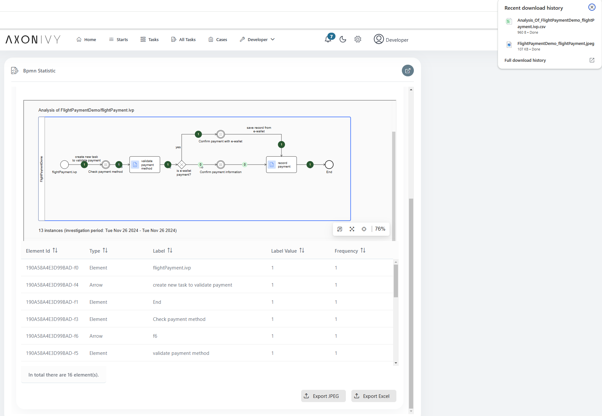

# Process Analyzer
Axon Ivy’s Process Analyzer Tool enables comprehensive insights into your workflow processes. 

Key features:
- **Visualize Process Diagrams**
: A clear and intuitive representation of your processes is provided through dynamic diagrams, which you are already familiar with from Axon Ivy.
- **Statistics at a Glance**
: Visualize workflow usage and duration directly on the diagram.
- **Time-Based Analysis**
: Filter and analyze data for specific time intervalls.
- **Custom Attribute Filtering**
: Utilize process-specific attributes (custom-field from task/case) to filter and refine your analysis for deeper insights.
- **Flexible Process Selection**
: Well integrated with any process from the same security context to leverage the tool's robust features.
- **Export Capabilities**
: Export diagram and detailed Excel reports with frequency/duration statistics.

## Demo

- Select the PMV  that matches the desired process and KPI type, then click the **"Show Statistic"** button. This will display a raw data visualized process diagram alongside an analyzed statistics table. *(In this version, the data is limited to **"DONE"** cases with fewer than **TWO** alternative elements in their process.)*


- To gain deeper insights, additional filter criteria have been included: 
  1) **Time interval filter:** By default, this filter includes all **"DONE"** cases with a start timestamp that falls within the specified time range.
  2) **Custom filter:** This option allows users to filter cases based on custom field values (from the case or task) that match the specified conditions.


- For reporting purposes, users can export a Excel file containing analyzed data or a FullHD diagram with KPI values directly from the two buttons located at the bottom-right corner of the UI.



## Setup

```
@variables.yaml@
```
