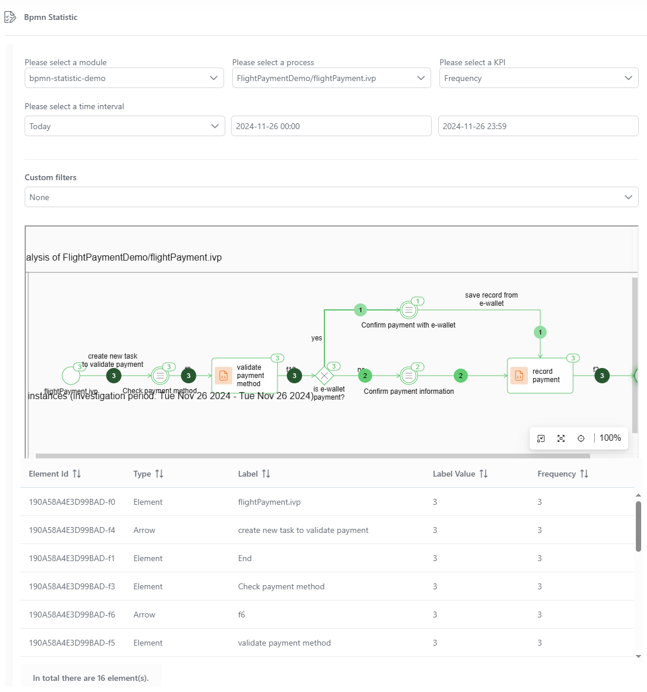
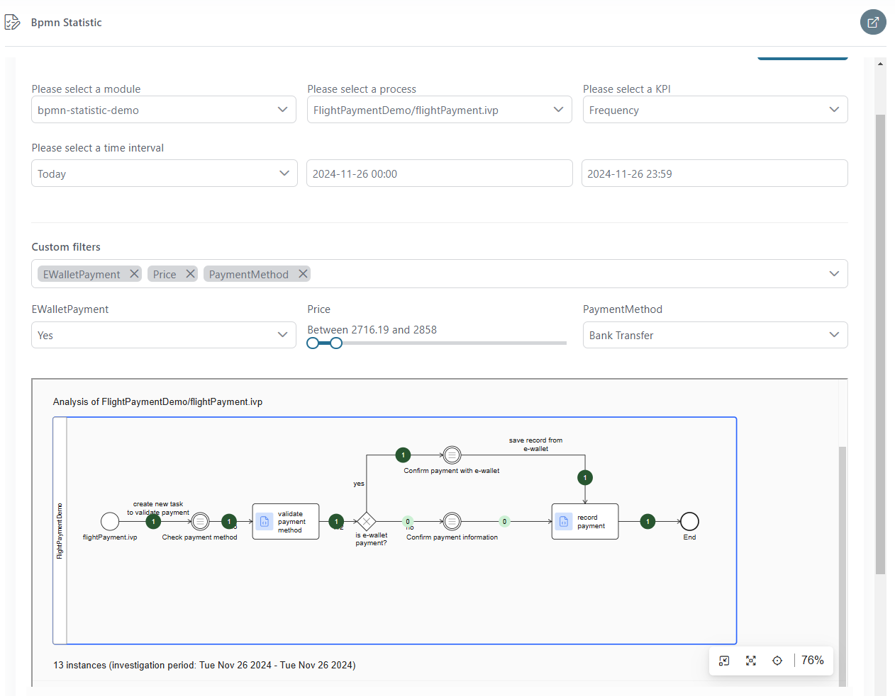
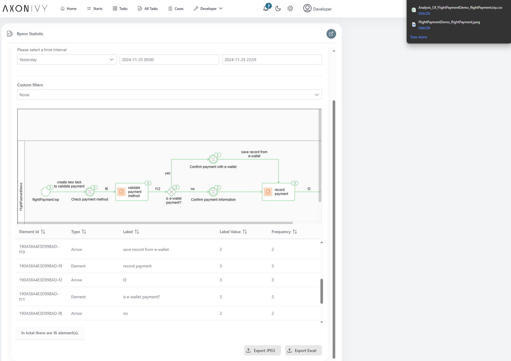
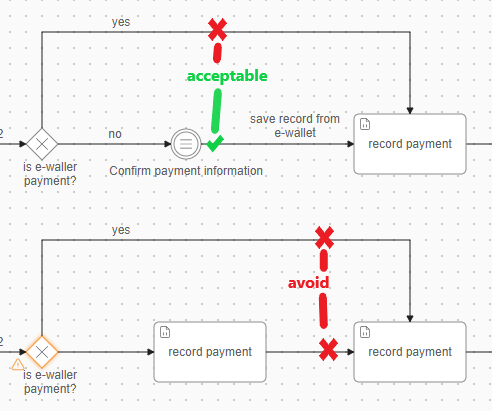

# Prozess Analyzer
Das Process-Analyzer-Tool von Axon Ivy bietet dir umfassende Einblicke in deine Workflow-Prozesse.

Hauptfunktionen:

- **Prozessdiagramme visualisieren**
: Eine klare und intuitive Darstellung deiner Prozesse wird durch dynamische Diagramme ermöglicht, die du schon aus Axon Ivy gewohnt bist.
- **Übersichtliche Statistiken**
: Visualisiere Nutzungsdaten und Auswertungen zur Aufgabendauer direkt im Prozessdiagramm.
- **Zeitbasierte Analyse**
: Filtere und analysiere Daten für spezifische Zeitintervalle
- **Benutzerdefinierte Attributfilter**
: Nutze prozessspezifische Attribute (z. B. benutzerdefinierte Felder aus Aufgaben oder Fällen), um deine Analyse detailliert zu verfeinern.
- **Flexible Prozessauswahl**
: Analyse Prozesse einem Security Kontext 
- **Export-Funktionen**
: Exportiere Prozessdiagramme und detaillierte Excel-Berichte mit Nutzungs- und Dauerstatistiken.

## Demo

- Select the PMV that matches the desired process and KPI type, then click the **"Show Statistic"** button. This will display a raw data visualized process diagram alongside an analyzed statistics table. *(In this version, the data is limited to **"DONE"** cases with fewer than **TWO** alternative elements in their process.)*



- To gain deeper insights, additional filter criteria have been included: 
  1) **Time interval filter:** By default, this filter includes all **"DONE"** cases with a start timestamp that falls within the specified time range.
  2) **Custom filter:** This option allows users to filter cases based on custom field values (from the case or task) that match the specified conditions.



- For reporting purposes, users can export a Excel file containing analyzed data or a FullHD diagram with KPI values directly from the two buttons located at the bottom-right corner of the UI.



## Setup
The Process Analyzer tool relies on task and case data from the AxonIvy System database for its analysis. Please adhere to the following practices to ensure data accuracy and precision:

- **Deployment of Process Models**
: To enable the Process Analyzer to access and analyze the desired process data, ensure that both process models are deployed within the same security context.

- **Validation of Alternative Flows**
: For any process alternative with multiple outgoing flows, ensure that each flow contains at least one task element along its path. *(It's still acceptable if there is only 1 out going path is mising task elements in its flow, as illustrated in the example process provided in the images.)*



```
@variables.yaml@
```

**Notice**
- **For complex process flows** *- such as those involving numerous alternatives, sub-elements, or rework loops,* we are actively working on enhancing the accuracy of the data.